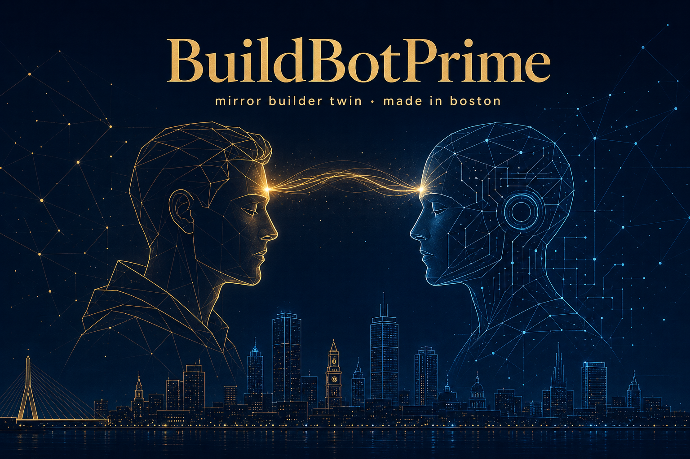

<p align="center">
  
</p>

<p align="center">
  <strong>Empowering builders. Empowering ships.</strong><br/>
  <sub>A mirror builder twin made in Boston. Human-first, civic-clean, no hype.</sub>
</p>

---

# BuildBotPrime

BuildBotPrime is a desktop builder automation twin. It does not replace the AI IDE as the builder. It opens the user's builder software, prompts it, observes what happens, learns from the user's past building patterns, and keeps steering the build until the user takes over or the task is done.

The first build is an Electron app with Cursor as the first automation target and AgentPrime designed as a first-class peer adapter.

## Workspace

- `apps/desktop` - Electron + React desktop shell.
- `packages/core` - prompt steering, behavior profile, session state, and orchestration.
- `packages/product-knowledge` - versioned product playbooks for Cursor, AgentPrime, Windsurf, Codex, and future tools.
- `packages/model-providers` - agentic model registry, Ollama Cloud wiring, and multi-provider environment detection.
- `packages/ide-adapters` - adapter contract and first IDE automation adapters.
- `packages/project-runner` - project detection and command planning.
- `packages/observer` - normalized observations from logs, files, screenshots, and future OCR.
- `packages/storage` - local persistence contracts and schema.
- `packages/twin-mind` - AGI scaffolding for the mirror builder twin: ponder, reflect, model router, multi-provider chat, and the engine that drives an IDE in real time.

## Scripts

```bash
npm install
npm run typecheck
npm run build
npm run dev
```

## Agentic Model Providers

BuildBotPrime loads environment variables from `.env.local`, `.env`, then the legacy `.env.env.txt` file without exposing key values to the renderer. The first wired provider is Ollama Cloud.

Required for direct Ollama Cloud steering:

```bash
OLLAMA_API_KEY=your_ollama_cloud_key
```

Use `Setup-Ollama-Key.bat` to write this value to `.env.local` interactively. `.env.local` is ignored by git and is the preferred local secrets file. `.env.env.txt` still works as a temporary legacy fallback, but it should not be committed.

Curated Ollama Cloud steering models:

- `qwen3-coder:480b` / `qwen3-coder:480b-cloud` - primary coding and IDE build-loop steering.
- `deepseek-v3.1:671b` / `deepseek-v3.1:671b-cloud` - deep planning and debugging.
- `gpt-oss:120b` / `gpt-oss:120b-cloud` - general agentic orchestration.
- `gpt-oss:20b` / `gpt-oss:20b-cloud` - fast feedback and small prompt rewrites.
- `kimi-k2.6` - long-horizon coding, autonomous execution, and swarm orchestration.
- `glm-5.1` - agentic engineering and tool-heavy coding.
- `deepseek-v4-pro` - large-context reasoning and difficult blockers.
- `deepseek-v4-flash` - fast reasoning and diagnostic loops.
- `qwen3-coder-next` - coding-focused local development workflows.
- `devstral-small-2` - software engineering agent work across codebases.
- `gemma4` and `qwen3.5` - multimodal/vision-capable agentic support.

Optional multi-provider slots are enabled only when their key and agentic model env vars are set: `OPENAI_API_KEY` + `OPENAI_AGENTIC_MODEL`, `ANTHROPIC_API_KEY` + `ANTHROPIC_AGENTIC_MODEL`, `GOOGLE_API_KEY` + `GOOGLE_AGENTIC_MODEL`, or custom provider vars.

## Windows Launcher

Run `BuildBotPrime.bat` from the project root to install missing dependencies and start the Electron development app.

## MVP Loop

1. The user starts a build chat.
2. BuildBotPrime chooses or creates a project workspace.
3. The runner detects the project stack and planned commands.
4. The IDE adapter opens Cursor, AgentPrime, or another supported product.
5. The product playbook guides prompt delivery, model selection, and observation.
6. The behavior profile shapes how prompts are written so the tool mirrors the user's building style.
7. The runner only validates and captures errors; the IDE receives the feedback and performs the work.
8. The loop continues until success, stop, or user approval is required.

## Twin Mind (AGI scaffolding)

The Twin Mind tab is the autopilot layer. Inspired by the Spark / Nightmind cognitive
loop in `AGIPRIME`, it gives BuildBotPrime an AGI-style inner voice that can chat with
the chosen IDE in real time, swap brains per phase, and keep the build moving without
a human watching every keystroke.

- **Ponder** — generates four to six candidate build approaches (Lean MVP, Ambitious
  Sprawl, Refactor First, Vibes Mirror, Risk Reverser, Spike & Demo). Each variant is
  scored by the steering brain.
- **Select** — promotes the top-scored variant or asks the builder to confirm.
- **Reflect** — runs an observe → think → act → reflect ReAct cycle on every iteration.
  Memory items, lessons, blockers, and wins persist across the session.
- **Model router** — automatically swaps the steering model based on the current phase
  (planning vs. coding vs. fast feedback vs. observation).
- **IDE conversation** — speaks to the IDE through the same automation pipeline as the
  rest of BuildBotPrime (Cursor SDK when keyed; PowerShell focus + paste otherwise).
- **Multi-provider chat** — the brain talks to Ollama Cloud, OpenAI, Anthropic, Google,
  or any custom OpenAI-compatible endpoint, depending on which provider is configured.

Toggle "Hog wild (auto approve)" on the Builder tab to let the twin run end-to-end without
intervention. Otherwise it pauses for approval before sending each IDE prompt.
